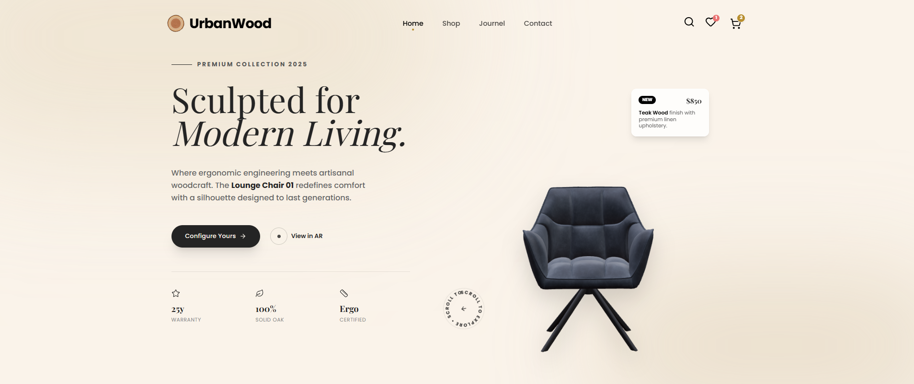

# Rootcraft - Premium Next.js E-commerce Template



## Overview

**Rootcraft** is a modern, high-performance e-commerce template built with **Next.js 16**, **React 19**, **Tailwind CSS 4**, and **Framer Motion**. Designed for furniture, home decor, and lifestyle brands, it features a sleek, responsive design, smooth animations, typed data utilities, and a robust component architecture perfect for showcasing premium wood furniture and home accessories.

## ✨ Features

- ⚡ **Next.js 16 (App Router)**: Leveraging the newest routing, caching, and metadata APIs
- 🎨 **Tailwind CSS 4**: Rapid UI development with the latest utility-first framework
- ✨ **Framer Motion & GSAP**: Stunning animations and micro-interactions
- 🛍️ **Cart & Wishlist**: Fully functional state management for shopping cart and wishlist
- 📱 **Fully Responsive**: Looks perfect on mobile, tablet, and desktop
- 🔍 **SEO Optimized**: Meta tags, structured data, sitemap, and robots.txt included
- 🧩 **Modular Components**: Easy to customize and extend
- 🌑 **Modern Design**: Clean aesthetics with a focus on user experience
- 📝 **Well Documented**: Production-quality JSDoc comments throughout
- 🎯 **Accessibility Enhanced**: ARIA labels and semantic HTML for better accessibility
- 📖 **Blog System**: Built-in blog with dynamic routing and beautiful typography
- 📞 **Contact & Checkout APIs**: `/api/contact` and `/api/checkout` endpoints ready for integration or mocking

## 🚀 Getting Started

### Prerequisites

Ensure you have the following installed:

- [Node.js](https://nodejs.org/) (v18 or higher)
- npm, yarn, pnpm, or bun

### Installation

1. Extract the template files to your desired location
2. Open terminal in the project directory
3. Install dependencies:

```bash
npm install
# or
yarn install
# or
pnpm install
```

4. Copy the example environment file and set your site URL:

```bash
cp .env.example .env.local
# on Windows PowerShell
Copy-Item .env.example .env.local
```

Update `NEXT_PUBLIC_SITE_URL` to match your deployed domain (used for metadata, sitemap, robots, and structured data).

5. Run the development server:

```bash
npm run dev
# or
yarn dev
# or
pnpm dev
```

5. Open [http://localhost:4000](http://localhost:4000) in your browser

### Building for Production

```bash
npm run build
npm run start
```

## 📁 Project Structure

```
rootcraft/
├── app/                # App Router pages and layouts
│   ├── components/     # Reusable UI components
│   ├── providers/      # Context providers (cart, wishlist)
│   ├── cart/           # Shopping cart page
│   ├── checkout/       # Checkout page
│   ├── blogs/          # Blog listing and detail pages
│   ├── contact/        # Contact page
│   ├── layout.tsx      # Root layout
│   └── page.tsx        # Home page
├── public/             # Static assets (images, fonts, icons)
├── lib/                # Utility functions and configurations
├── next.config.ts      # Next.js configuration
├── tailwind.config.ts  # Tailwind CSS configuration
├── postcss.config.mjs  # PostCSS configuration
└── ...
```

## 🎨 Customization

### Colors & Fonts

Tailwind CSS 4 handles styling. Customize the theme in `app/globals.css`:

```css
@theme {
  --color-primary: /* your color */ ;
  --font-sans: /* your font */ ;
  --font-heading: /* your heading font */ ;
}
```

### Environment Variables

- `NEXT_PUBLIC_SITE_URL` — absolute origin (e.g., `https://rootcraft.example.com`). Used for canonical tags, sitemaps, robots.txt, and structured data.

### Content

Catalog, product detail, and blog copy live in the `/data` directory:

- `data/products.ts` — primary product catalogue (slugs, pricing, galleries, tags)
- `data/blogPosts.ts` — blog listing + detail entries

You can replace these with:

- **Headless CMS** (Contentful, Sanity, Strapi)
- **REST API** or **GraphQL** endpoints
- **Database** (PostgreSQL, MongoDB) wired through server actions or API routes

## 📦 Preparing ThemeForest Submission

Before zipping the template for review, make sure to:

1. Run quality gates
   ```bash
   npm run lint
   npm run build
   ```
2. Remove development artifacts from the export (they are ignored in git but can sneak into zips):
   ```bash
   rm -rf .next node_modules
   # Windows PowerShell
   Remove-Item -Recurse -Force .next,node_modules
   ```
3. Archive the clean project folder (source files + public assets only).

This keeps the download size small, avoids accidental dependency bundling, and matches ThemeForest packaging guidelines.

### Images

**Important**: All placeholder images are from [Unsplash](https://unsplash.com) and are for demonstration purposes only. Please see [CREDITS.md](CREDITS.md) for attribution. Replace them with your own licensed images before deploying to production.

## 📚 Documentation

- **README.md** - This file, getting started guide
- **LICENSE.md** - License terms and conditions
- **CREDITS.md** - Third-party attributions and image credits
- **CHANGELOG.md** - Version history and updates

## 🙏 Credits

For a complete list of third-party libraries, resources, and image attributions, see [CREDITS.md](CREDITS.md).

Major technologies used:

- [Next.js](https://nextjs.org/) - React framework
- [React](https://react.dev/) - UI library
- [Tailwind CSS](https://tailwindcss.com/) - Utility-first CSS framework
- [Framer Motion](https://www.framer.com/motion/) - Animation library
- [GSAP](https://greensock.com/) - Professional animation platform
- [Lucide React](https://lucide.dev/) - Beautiful icon library

### Image Credits

All demonstration images are provided by talented photographers on [Unsplash](https://unsplash.com). See [CREDITS.md](CREDITS.md) for detailed attribution.

## 📄 License

This template is licensed under a proprietary commercial license.

**What you CAN do:**

- ✅ Use for personal and commercial projects
- ✅ Create unlimited end products (websites) for yourself or clients
- ✅ Modify and customize the code to fit your needs
- ✅ Use in end products that generate revenue

**What you CANNOT do:**

- ❌ Redistribute or resell the template source code
- ❌ Share template files with others who haven't purchased
- ❌ Sublicense to third parties
- ❌ Create competing template products or derivative templates for sale

For complete license terms, see [LICENSE.md](LICENSE.md).

## 💬 Support

For technical support, bug reports, or feature requests:

- Contact the author through your purchase platform
- Check the documentation files included
- Review the changelog for updates and fixes

## 📝 Changelog

See [CHANGELOG.md](CHANGELOG.md) for detailed version history and updates.

### Version 1.0.0 (November 22, 2025)

- 🎉 Initial release
- 🎨 Complete UI/UX design system for furniture e-commerce
- 🛍️ Full cart and wishlist functionality with local storage
- 📱 Fully responsive design (mobile-first approach)
- ✨ Smooth animations with Framer Motion and GSAP
- 🔍 SEO optimized with proper meta tags and structured data
- 📝 Comprehensive JSDoc documentation
- 📖 Built-in blog system with dynamic routing
- 🎯 Enhanced accessibility features
- 📞 Contact page with form validation

---

**Rootcraft** - Crafted with ❤️ for furniture and home decor brands

© 2025 Rootcraft. All rights reserved.
